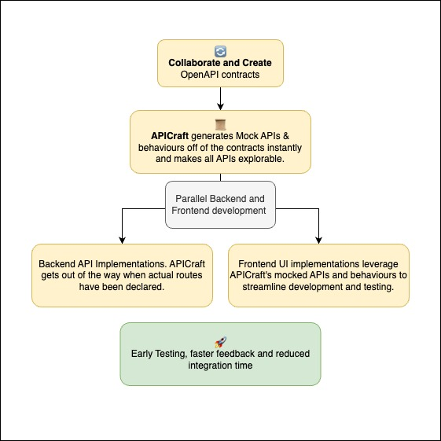
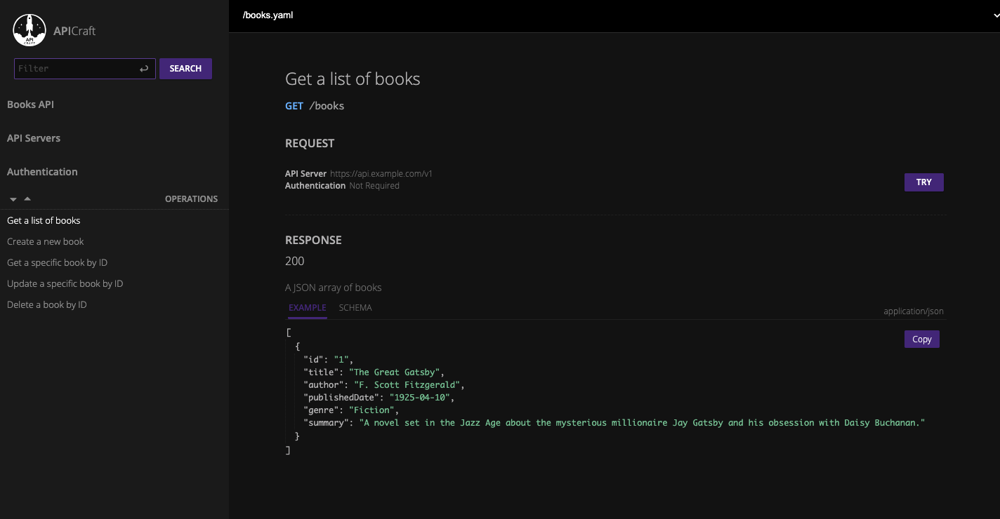
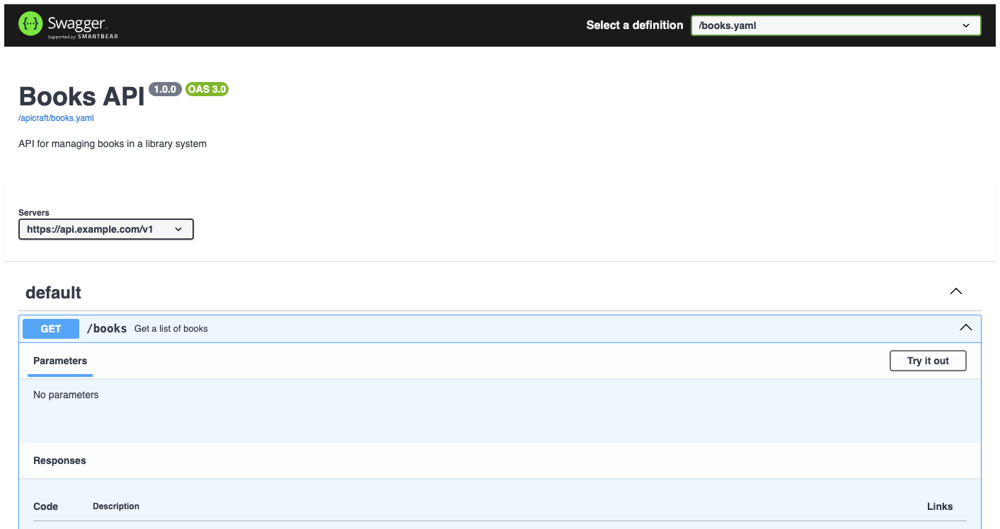

# APICraft Rails
[](https://github.com/apicraft-dev/apicraft-rails/actions/workflows/build.yml)
[](https://badge.fury.io/rb/apicraft-rails)

🚀 Accelerates your development by 2-3x with an API Design First approach. Seamlessly integrates with your Rails application server — no fancy tooling or expenses required.

We believe that API contracts should lead the development process, not be an afterthought derived from code. This framework embraces the [**API Design-First philosophy**](#-api-design-first-philosophy), ensuring that contracts remain independent from implementation.

With APICraft, contracts are not only clear and consistent, but they’re also immediately usable, enabling teams to work with automatically generated mocks, behaviours and introspection tools, allowing development to begin in parallel, without waiting for backend implementations.

It avoids the pitfalls of the code-first methodology, where contracts are auto-generated, often leading to inconsistency and misalignment.


- [APICraft Rails](#apicraft-rails)
  - [✨ Features](#-features)
  - [🕊 API Design First Philosophy](#-api-design-first-philosophy)
  - [🏗 Installation](#-installation)
  - [⚙️ Usage](#️-usage)
    - [🛡️ Request Validations](#️-request-validations)
    - [🎭 Mocking](#-mocking)
    - [🎮 Behaviour Mocking](#-behaviour-mocking)
    - [🧐 Introspection](#-introspection)
    - [📖 Documentation (Swagger docs and RapiDoc)](#-documentation-swagger-docs-and-rapidoc)
    - [📖 CLI Support](#-cli-support)
  - [🔧 Configuration](#-configuration)
  - [🤝 Contributing](#-contributing)
  - [📝 License](#-license)
  - [📘 Code of Conduct](#-code-of-conduct)

## ✨ Features
- 🛡️ **Automatic Request Validations** - Validates the request based on the openapi specs so that you don't need to add params validations everywhere in your controllers.

- 🧑‍💻️ **Dynamic Mock Data Generation** - Detects the specifications and instantly mounts working routes with mock responses. No extra configuration required.

- ⚙️ **Customizable Mock Responses** - Tailor mock responses to simulate different scenarios and edge cases, helping your team prepare for real-world conditions right from the start.

- 🔍 **API Introspections** - Introspect API schemas without needing to dig into the docs everytime.

- 📺 **Documentation Out of the Box** - Documentation using `SwaggerDoc` and `RapiDoc` both.

- 🗂 **Easy Contracts Management** - Management of `openapi` specifications from within `app/contracts` directory. No new syntax, just plain old `openapi` standard with `.json` or `.yaml` formats

- 🗂 **CLI Support** - Specification validations can be triggered from the CLI allowing integrations into your CI/CD pipelines.

## 🕊 API Design First Philosophy



The API Design First philosophy is at the heart of APICraft Rails, and it’s a game-changer for development speed and efficiency:

- 🔄 **Parallel Development:** By designing your APIs upfront, both frontend and backend teams can work simultaneously using mock APIs, eliminating bottlenecks and reducing wait times.

- 📜 **Clear Contracts:** OpenAPI contracts serve as a single source of truth, ensuring that all teams are aligned on how the API should behave, reducing misunderstandings and rework.

- ⚙️ **Early Testing:** Mock APIs allow QA to begin testing earlier in the development cycle, catching issues before they become costly to fix.

- 🔍 **Faster Feedback Loop:** Immediate feedback on API design helps you iterate quickly, refining your API based on real usage scenarios, ultimately leading to a more robust product.

- 🚀 **Reduced Integration Time:** With consistent API contracts in place, integrating various components becomes smoother and faster, cutting down on the time required to bring everything together.

By adopting an API Design First approach with APICraft Rails, you can accelerate your development process by 2-3x, delivering high-quality APIs faster and with fewer headaches.


## 🏗 Installation

1. Add this line to your application's Gemfile:

```ruby
gem 'apicraft-rails', '~> 1.0.2'
```

2. And then execute:
```bash
$ bundle install
$ rails apicraft:init
```

This will create a file called `config/initializers/apicraft.rb` with all the necessary configurations. It will also create the default contracts directory called `app/contracts`.


3. Add the `apicraft` route to your route file (for documentation):

```ruby
Rails.application.routes.draw do
  # other routes
  mount Apicraft::Web::App, at: "/apicraft"
end
```

Now every API in the specification has a functional version. For any path (from the contracts), APICraft serves a mock response when `Apicraft-Mock: true` is passed in the headers otherwise, it forwards the request to your application as usual.

4. Generate a sample spec file
```
rails apicraft:generate file=v2/openapi
```

This will generate a sample file called `app/contracts/v2/openapi.yaml`
## ⚙️ Usage

Add your specification files to the `app/contracts` directory in your Rails project. You can also configure this directory to be something else.
```
my_rails_app/
├── app/
│   ├── controllers/
│   │   ├── application_controller.rb
│   │   └── users_controller.rb
│   ├── contracts/
│   │   ├── users_contract.yaml
│   │   └── orders_contract.yaml
│   ├── models/
│   │   ├── user.rb
│   │   └── order.rb
```

### 🛡️ Request Validations
All incoming requests will be validated against the defined schema. This ensures that by the time the params reach the controller they are adhering to all the schema requirements. It's enabled by default. You can customize the response of a failed validation. Check the [configuration section](#-configuration) section for a full list of options for this.

### 🎭 Mocking
**APICraft** dynamically generates mock APIs by interpreting contract specifications on the fly. You can request the mock response by passing `Apicraft-Mock: true` in the headers.

`https://yoursite.com/api/orders`
```
headers: {
  Apicraft-Mock: true
}
```
```json
[
  {
    "id": 66,
    "name": "tempora",
    "description": "error"
  },
  {
    "id": 41,
    "name": "et",
    "description": "id"
  }
]
```

### 🎮 Behaviour Mocking
The above is an example of a 200 response. If you have more responses documented you can force that behaviour using `Apicraft-Response-Code` header in the mock request.
You can find a list of all the supported headers in the [configuration section](#-configuration) that would allow you to manipulate the API Behaviour.

`https://yoursite.com/api/orders`
```
headers: {
  Apicraft-Response-Code: 400
  Apicraft-Mock: true
  Apicraft-Delay: 5
}
```
```json
{
  "code": 400,
  "message": "Something's not right"
}
```

### 🧐 Introspection
All APIs are can be introspected. You can do so by passing the `Apicraft-Introspect` header.

```
headers: {
  Apicraft-Introspect: true
}
```

Example: `https://yoursite.com/api/orders`
```json
{
  "summary": "Retrieve a list of orders",
  "description": "Returns a list of orders in either JSON or XML format.",
  "operationId": "getOrders",
  "parameters": [
    {
      "name": "format",
      "in": "query",
      "description": "The response format (json or xml)",
      "required": false,
      "schema": {
        "type": "string",
        "enum": [
          "json",
          "xml"
        ]
      }
    }
  ],
  "responses": {}
}
```
### 📖 Documentation (Swagger docs and RapiDoc)

Mount the documentation views in your route file.

```ruby
# config/routes.rb

Rails.application.routes.draw do
  # Rest of the routes...
  mount Apicraft::Web::App, at: "/apicraft"
end
```

You can browse API Documentation at
- `/apicraft/swaggerdoc`
- `/apicraft/rapidoc`

Enable authentication for the `/apicraft` namespace.

```ruby
# config/application.rb
module App
  class Application < Rails::Application
    # Rest of the configuration...
    Apicraft::Web::App.use do |user, password|
      [user, password] == ["admin", "password"]
    end
  end
end
```
RapiDoc                    |  SwaggerDoc
:-------------------------:|:-------------------------:
  |  

### 📖 CLI Support

To check if all the specification are valid
```
$ rails apicraft:validate
```

To generate a new spec file in the contracts directory
```
$ rails apicraft:generate file=openapi
```
## 🔧 Configuration

List of available configurations.

```ruby
Apicraft.configure do |config|
  config.contracts_path = Rails.root.join("app/contracts")

  # Enables or disables the mocking features
  # Defaults to true
  config.mocks = true

  # Enables or disables the introspection features
  # Defaults to true
  config.introspection = true

  # allows you to enforce stricter validation of $ref
  # references in your OpenAPI specifications.
  # When this option is enabled, the parser will raise
  # an error if any $ref references in your OpenAPI
  # document are invalid, ensuring that all references
  # are correctly defined and resolved.
  # Defaults to true
  config.strict_reference_validation = true

  # When simulating delay using the mocks, the max
  # delay in seconds that can be simulated
  config.max_allowed_delay = 30

  config.headers = {
    # The name of the header used to control
    # the response code of the mock
    # Defaults to Apicraft-Response-Code
    response_code: "Apicraft-Response-Code",

    # The name of the header to introspect the API.
    # Defaults to Apicraft-Introspect
    introspect: "Apicraft-Introspect",

    # The name of the header to mock the API.
    # Defaults to Apicraft-Mock
    mock: "Apicraft-Mock",

    # Delay simulation header name
    delay: "Apicraft-Delay"
  }

  config.request_validation = {
    enabled: true,

    # Return the http code for validation errors, defaults to 400
    http_code: 400,

    # Return a custom response body, defaults to `{ message: "..." }`
    response_body: proc do |ex|
      {
        message: ex.message
      }
    end
  }
end

Apicraft::Web::App.use do |user, password|
  [user, password] == ["admin", "password"]
end
```

## 🤝 Contributing

Bug reports and pull requests are welcome on GitHub at https://github.com/apicraft-dev/apicraft-rails. This project is intended to be a safe, welcoming space for collaboration, and contributors are expected to adhere to the [code of conduct](https://github.com/apicraft-dev/apicraft-rails/blob/main/CODE_OF_CONDUCT.md).

## 📝 License

The gem is available as open source under the terms of the [MIT License](https://opensource.org/licenses/MIT).

## 📘 Code of Conduct

Everyone interacting in the Apicraft project's codebases, issue trackers, chat rooms and mailing lists is expected to follow the [code of conduct](https://github.com/[USERNAME]/apicraft/blob/main/CODE_OF_CONDUCT.md).
